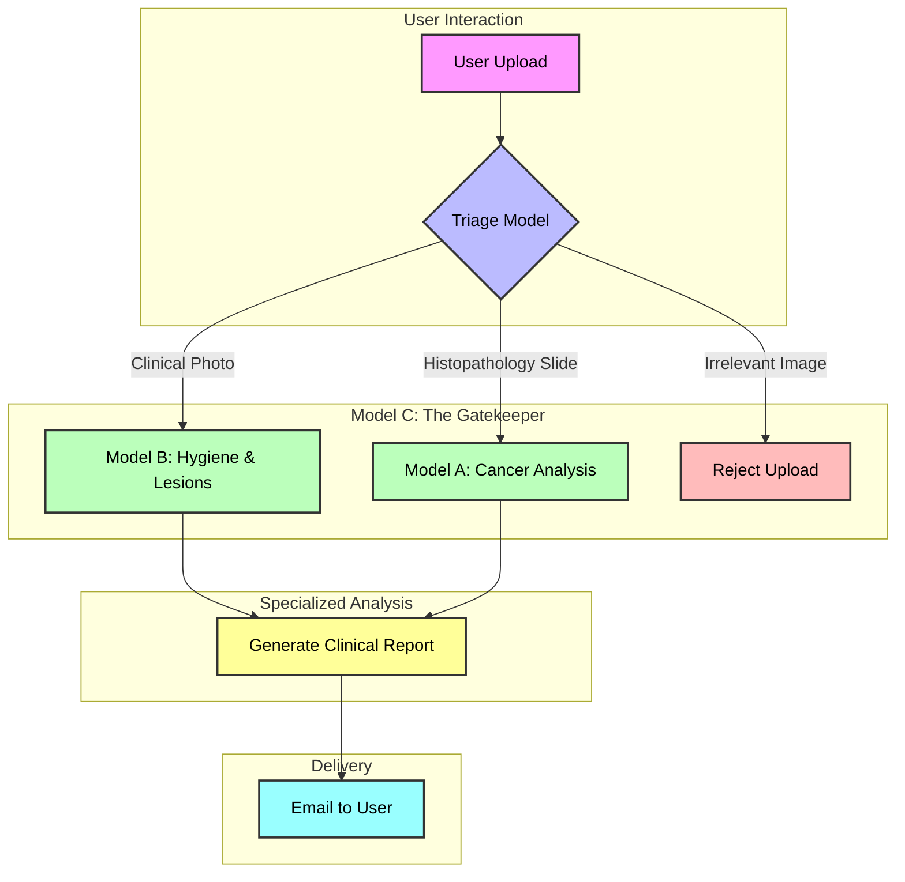

# 🦷 Oral AI: Advanced Disease Detection System

[](https://huggingface.co/spaces/IvanJun/Oral_AI_Cancer_Disease_Detection)
[](https://www.python.org/)
[](https://fastapi.tiangolo.com/)
[](https://pytorch.org/)
[](https://www.docker.com/)
[](LICENSE)

> **🚀 LIVE DEMO:** [**Click here to interact with the App on Hugging Face Spaces**](https://ivanjun-oral-ai-cancer-disease-detection.hf.space)

---

### 📋 Table of Contents
- [Overview](#-overview)
- [🧠 AI Under the Hood](#-ai-under-the-hood-architecture)
    - [The Triage Gatekeeper](#1%EF%B8%8F%E2%83%A3-the-triage-gatekeeper-model-c)
    - [The Pathology Expert](#2%EF%B8%8F%E2%83%A3-the-pathology-expert-model-a)
    - [The Hygiene Specialist](#3%EF%B8%8F%E2%83%A3-the-hygiene-specialist-model-b)
- [✨ Key Features](#-key-features)
- [Installation Guide](#-manual-installation--usage)
- [Docker Deployment](#-docker-deployment)
- [Project Structure](#-project-structure)
- [Contact & Support](#-contact--support)

---

## 📖 Overview

**Oral AI** is a cutting-edge medical diagnostic ecosystem designed to bridge the gap between patients and early diagnosis. By leveraging a **Multi-Model Deep Learning Pipeline**, the system provides instant, privacy-focused analysis of oral cavity images.

It doesn't just "detect"; it **understands** the difference between a microscopic biopsy slide and a smartphone selfie, routing each to the correct specialist model for maximum accuracy.

---

## 🧠 AI Under the Hood: Architecture

Our system uses a "Smart Triage" architecture to chain three specialized Neural Networks together.

<details>
<summary><b>👆 Click to see the Full Pipeline Diagram</b></summary>


</details>

### 1️⃣ The Triage Gatekeeper (Model C)
*   **Architecture**: **ResNet18** (Transfer Learning)
*   **Role**: The first line of defense. It classifies input images into two distinct categories:
    *   **Clinical**: Standard RGB photos of the oral cavity (teeth, gums, tongue).
    *   **Histopathological**: Microscopic H&E stained biopsy slides.
*   **Why?** This routing mechanism ensures that a microscopic model never sees a selfie, and vice versa, preventing false positives and saving computational resources.

### 2️⃣ The Pathology Expert (Model A)
*   **Architecture**: **Multi-Task DenseNet169** with Custom Heads.
*   **Input**: Histopathological (H&E Stained) Microscope Slides.
*   **Preprocessing (Macenko Normalization)**: Pathology slides vary greatly in color depending on the lab's staining process. We use **Macenko Normalization** to mathematically align the color distribution of every input slide to a "reference" standard before the AI sees it. This makes the model robust to different scanners and staining protocols.
*   **Capabilities (Multi-Head Output)**:
    *   **Tumour vs Non-Tumour (TVNT)**: Binary classification to detect cancer presence.
    *   **Pattern of Invasion (POI)**: Classifies the invasion pattern (5 grades).
    *   **Perineural Invasion (PNI)**: Detects if cancer has invaded nerves.
    *   **Tumour Buds (TB)**: Regression head to count tumour buds (prognostic indicator).
    *   **Mitotic Index (MI)**: Regression head to estimate cell division rate.
    *   **Segmentation**: U-Net style decoder to generate pixel-level heatmaps of the tumour area.

### 3️⃣ The Hygiene Specialist (Model B)
*   **Architecture**: **YOLOv8** (You Only Look Once) + **SAHI** (Slicing Aided Hyper Inference).
*   **Input**: Smartphone Photos of the Mouth.
*   **Advanced Inference (Why SAHI?)**: Standard object detection models resize images to low resolutions (e.g., 640x640). In a high-res mouth photo, a small cavity might become just 1-2 pixels after resizing, making it impossible to detect. **SAHI** chops the image into overlapping tiles, runs detection on each tile at full resolution, and then stitches the results back together to detect even the smallest lesions.
*   **Detection Classes**:
    *   `Caries` (Cavities)
    *   `Calculus` (Tartar/Plaque)
    *   `Gingivitis` (Gum Inflammation)
    *   `Ulcers`
    *   `Tooth Discoloration`
    *   `Hypodontia` (Missing Teeth)

---

## 🛠️ Tech Stack & Skills

This project integrates a wide range of modern technologies, demonstrating expertise in full-stack AI development.

### **Core AI & Deep Learning**
*    **PyTorch**: The backbone for training and inference of all neural networks.
*    **OpenCV**: Used for image preprocessing, Macenko normalization, and contour drawing.
*    **Ultralytics YOLOv8**: State-of-the-art object detection for clinical images.
*   **SAHI (Slicing Aided Hyper Inference)**: Advanced technique for small object detection in high-resolution images.

### **Backend & API**
*    **FastAPI**: High-performance, asynchronous web framework for serving models.
*    **Python 3.10**: The primary programming language.
*    **Google Gemini API**: Powers the RAG-based medical chatbot.
*    **Brevo (Sendinblue)**: Transactional email API for delivering PDF reports.

### **DevOps & Deployment**
*    **Docker**: Containerization for consistent deployment across environments.
*    **Hugging Face Spaces**: Cloud hosting platform for the demo.
*    **Git LFS**: Managing large model weights (>100MB).

### **Frontend**
*    **HTML5 / CSS3**: Responsive and clean user interface.
*    **Vanilla JavaScript**: Handles asynchronous API calls and dynamic UI updates.

---

## 🤖 AI Chatbot (RAG-Enhanced)

The platform features a context-aware medical assistant powered by **Google Gemini Gemma-3**.

### 🔄 Technical Workflow & API Integration
The chatbot doesn't just "guess"; it uses **Retrieval-Augmented Generation (RAG)** to ground its answers in the model's findings.

1.  **Context Retrieval**:
    *   The system fetches the JSON output from the inference engine (e.g., `{"detected": ["Gingivitis"], "confidence": 0.88}`).
2.  **Prompt Engineering**:
    *   We construct a dynamic prompt that enforces a "Medical Persona".
    *   *Template*:
        ```text
        SYSTEM: You are an empathetic oral health assistant.
        CONTEXT: The user's image analysis shows [Gingivitis] with [High] confidence.
        USER QUERY: {user_input}
        GUARDRAILS: Do not diagnose. Suggest professional care.
        ```
3.  **API Call**:
    *   The constructed prompt is sent to the **Gemini Gemma-3 API** (`generativelanguage.googleapis.com`).
    *   The response is streamed back to the frontend, providing an instant, conversational explanation of the visual results.

*   **Example Interaction**:
    *   *User*: "Is this bad?"
    *   *AI (sees Model B detected 'Gingivitis')*: "The analysis detected signs of Gingivitis. While this is common, it indicates gum inflammation. I recommend seeing a dentist for a cleaning..."

---

## ✨ Key Features

| Feature | Description |
| :--- | :--- |
| **⚡ Real-time Inference** | Optimized PyTorch inference allows for analysis in under 3 seconds per image. |
| **🤖 Medical Chatbot** | Integrated RAG-based Chatbot (powered by Gemini) that knows your specific analysis results and answers follow-up questions contextually. |
| **📄 Smart Reporting Suite** | Generates professional PDF reports including **visual evidence**. Emails now deliver both the report and high-res **annotated images** directly to the user. |
| **🖥️ Interactive Viewport** | New "Dark Mode" analysis interface with **Glassmorphism controls**, fullscreen inspection, and dynamic overlay toggles. |
| **🔒 Privacy First** | HIPAA-compliant design: Images are processed in RAM and wiped immediately after analysis. |
| **☁️ Cloud Native** | Fully containerized with Docker, ready for serverless deployment. |

---

## 🚀 Latest Enhancements (v2.0)

We have recently upgraded the platform with professional-grade UI and reporting capabilities:

### 1. High-Fidelity Visual Reporting
The system now ensures that what you see is what you get.
*   **Canvas-to-Image Rendering**: We implemented a client-side engine that renders bounding boxes and confidence labels directly onto a high-resolution canvas.
*   **Annotated Exports**: When a user requests a report, this canvas is converted to a high-quality JPEG and embedded into the PDF and attached to the email. This ensures the doctor/patient sees the exact same detections in the file as they did on the screen.

### 2. Professional Analysis Viewport
The frontend has been redesigned to mimic professional medical imaging software:
*   **Dark Mode Viewport**: Reduces eye strain and improves contrast for identifying lesions.
*   **Glassmorphism Controls**: Floating, semi-transparent controls for toggling heatmaps/detections without obstructing the image.
*   **Fullscreen Inspection**: Users can now expand the analysis view to examine fine details.

### 3. Robust Backend Compatibility
*   **Format Agnostic**: Added intelligent image conversion to handle WebP, PNG, and JPEG uploads seamlessly for PDF generation.
*   **Cross-Platform Support**: Fixed file permission and pathing issues to ensure smooth operation on both Windows (Localhost) and Linux (Docker/Cloud) environments.

---

## 🛠️ Manual Installation & Usage

Want to run this locally? Follow these steps to compile and run the server on your machine.

### Prerequisites
*   **Python 3.10+**
*   **Git** (Make sure [Git LFS](https://git-lfs.com/) is installed for large model files)

### 1. Clone the Repository
```bash
git clone https://github.com/VanVan120/Oral-Health-Computer-Vision-Model.git
cd Oral-Health-Computer-Vision-Model
git lfs pull  # Crucial: Downloads the actual AI model weights
```

### 2. Install Dependencies
We recommend using a virtual environment to keep your system clean.

**Windows:**
```bash
python -m venv venv
venv\Scripts\activate
pip install -r requirements.txt
```

**Mac / Linux:**
```bash
python3 -m venv venv
source venv/bin/activate
pip install -r requirements.txt
```

### 3. Configure Environment Variables
You need a Brevo API key for the email reporting feature to work.

**Option A:** Create a `.env` file in the root folder.

**Option B:** Set it in your terminal:
```bash
# Windows PowerShell
$env:BREVO_API_KEY="your_brevo_api_key_here"

# Mac/Linux Terminal
export BREVO_API_KEY="your_brevo_api_key_here"
```

### 4. Run the Application
Start the server locally. It will launch at `http://localhost:8000`.

```bash
# Using the Python launcher
python main.py
```

---

## 🐳 Docker Deployment

This project is fully containerized. To run it using Docker without installing Python dependencies manually:

### Build the Image
```bash
docker build -t oral-ai-backend .
```

### Run the Container
```bash
docker run -p 7860:7860 -e BREVO_API_KEY="your_key" oral-ai-backend
```
*Access the app at `http://localhost:7860`*

---

## 📂 Project Structure

A quick look at the codebase organization:

```text
📦 Oral-Health-Computer-Vision-Model
 ┣ 📂 Model A             # 🧬 Pathology Model (DenseNet/ResNet)
 ┣ 📂 Model B             # 🦷 Hygiene Model (YOLOv8)
 ┣ 📂 Model Triage        # 🛡️ Router Model (MobileNet)
 ┣ 📂 static              # 🎨 Frontend (HTML, CSS, JS)
 ┣ 📜 main.py             # ⚡ FastAPI Application Entry Point
 ┣ 📜 report_gen.py       # 📄 PDF Generation Logic
 ┣ 📜 chatbot.py          # 🤖 AI Chatbot Logic
 ┣ 📜 Dockerfile          # 🐳 Container Configuration
 ┗ 📜 requirements.txt    # 📦 Python Dependencies
```

---

## 🤝 Contact & Support

Developed for **SEGP - Multi-task Deep Learning for Quantifying Key Histopathological Features in Oral 
Cancer**.

*   **Developer**: Ivan Char Cheng Jun
*   **Issues**: [Report a Bug](https://github.com/VanVan120/Oral-Health-Computer-Vision-Model/issues)

> **Disclaimer**: This tool is for educational and assistive purposes only. It does not replace professional medical advice.

